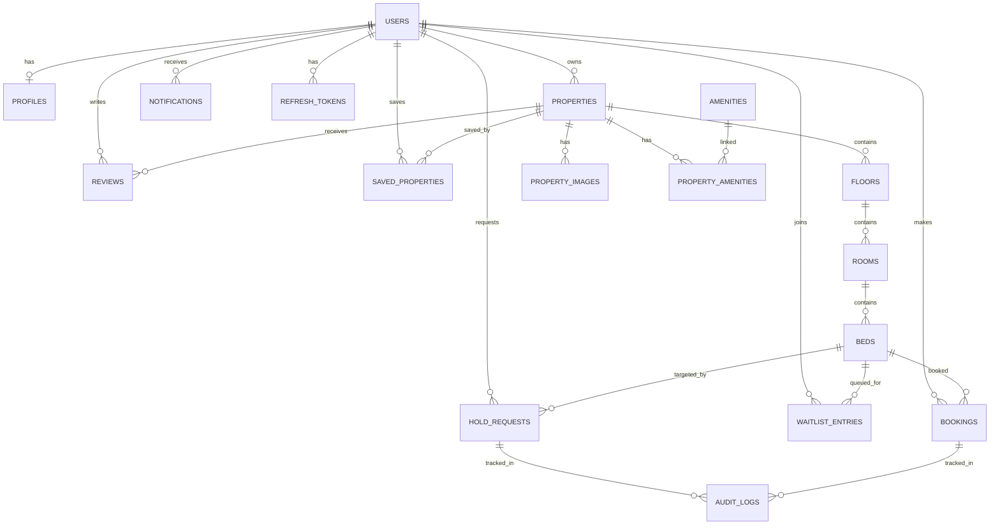

# DATABASE_SCHEMA.md — StaySync

> **Version:** 1.0  
> **Last Updated:** 2026-05-30  
> **Database:** Supabase PostgreSQL 16  
> **ORM:** SQLAlchemy 2.0 (async)  
> **Migrations:** Alembic

---

## 1. Schema Overview

### Entity-Relationship Diagram



### Table Summary

| #  | Table                | Phase | Purpose                              |
| -- | -------------------- | ----- | ------------------------------------ |
| 1  | `users`              | 1     | Authentication & identity            |
| 2  | `profiles`           | 1     | Extended user information            |
| 3  | `refresh_tokens`     | 1     | JWT refresh token storage            |
| 4  | `properties`         | 1     | Accommodation listings               |
| 5  | `floors`             | 1     | Floor hierarchy                      |
| 6  | `rooms`              | 1     | Room hierarchy                       |
| 7  | `beds`               | 1     | Bed inventory (atomic unit)          |
| 8  | `amenities`          | 1     | Master amenity catalog               |
| 9  | `property_amenities` | 1     | Property ↔ Amenity junction          |
| 10 | `property_images`    | 1     | Image references (property/room/bed) |
| 11 | `hold_requests`      | 2     | Temporary hold records               |
| 12 | `waitlist_entries`   | 2     | Waitlist queue                       |
| 13 | `bookings`           | 2     | Confirmed occupancy records          |
| 14 | `notifications`      | 2     | In-app notification store            |
| 15 | `reviews`            | 3     | Property reviews & ratings           |
| 16 | `saved_properties`   | 1     | Student wishlists                    |
| 17 | `audit_logs`         | 2     | Activity tracking                    |

---

## 2. Enum Definitions

### Application-Level Enums (stored as VARCHAR)

```python
class UserRole(str, Enum):
    STUDENT = "student"
    OWNER = "owner"
    ADMIN = "admin"

class PropertyType(str, Enum):
    PG = "pg"
    HOSTEL = "hostel"
    FLAT = "flat"
    APARTMENT = "apartment"

class GenderPreference(str, Enum):
    MALE = "male"
    FEMALE = "female"
    COED = "coed"

class SharingType(str, Enum):
    SINGLE = "single"
    DOUBLE = "double"
    TRIPLE = "triple"
    QUAD = "quad"

class BedStatus(str, Enum):
    VACANT = "vacant"          # 🟢 GREEN
    HELD = "held"              # 🟡 YELLOW
    OCCUPIED = "occupied"      # 🔴 RED

class HoldStatus(str, Enum):
    PENDING = "pending"        # Awaiting owner response
    APPROVED = "approved"      # Owner approved, hold active
    REJECTED = "rejected"      # Owner rejected
    EXPIRED = "expired"        # Auto-expired after timeout
    OVERRIDDEN = "overridden"  # Owner manually occupied bed
    CANCELLED = "cancelled"    # Student cancelled

class WaitlistStatus(str, Enum):
    ACTIVE = "active"          # In queue
    PROMOTED = "promoted"      # Moved to active hold
    EXPIRED = "expired"        # Removed from queue
    CANCELLED = "cancelled"    # Student left queue

class BookingStatus(str, Enum):
    CONFIRMED = "confirmed"    # Active occupancy
    VACATED = "vacated"        # Student left
    CANCELLED = "cancelled"    # Booking cancelled

class NotificationType(str, Enum):
    HOLD_REQUESTED = "hold_requested"
    HOLD_APPROVED = "hold_approved"
    HOLD_REJECTED = "hold_rejected"
    HOLD_EXPIRED = "hold_expired"
    HOLD_OVERRIDDEN = "hold_overridden"
    HOLD_EXPIRING_SOON = "hold_expiring_soon"
    WAITLIST_PROMOTED = "waitlist_promoted"
    BOOKING_CONFIRMED = "booking_confirmed"
    PROPERTY_VERIFIED = "property_verified"
    SYSTEM_ANNOUNCEMENT = "system_announcement"

class ImageEntityType(str, Enum):
    PROPERTY = "property"
    FLOOR = "floor"
    ROOM = "room"
    BED = "bed"

class PropertyStatus(str, Enum):
    DRAFT = "draft"
    PENDING_REVIEW = "pending_review"
    ACTIVE = "active"
    INACTIVE = "inactive"
    SUSPENDED = "suspended"

class AuditAction(str, Enum):
    HOLD_CREATED = "hold_created"
    HOLD_APPROVED = "hold_approved"
    HOLD_REJECTED = "hold_rejected"
    HOLD_EXPIRED = "hold_expired"
    HOLD_OVERRIDDEN = "hold_overridden"
    HOLD_CANCELLED = "hold_cancelled"
    BOOKING_CONFIRMED = "booking_confirmed"
    BOOKING_VACATED = "booking_vacated"
    BED_STATUS_CHANGED = "bed_status_changed"
    PROPERTY_CREATED = "property_created"
    PROPERTY_UPDATED = "property_updated"
    PROPERTY_DELETED = "property_deleted"
```

---

## 3. Table Definitions

### Common Columns (all tables inherit)

```sql
id              UUID        PRIMARY KEY DEFAULT gen_random_uuid()
created_at      TIMESTAMPTZ NOT NULL DEFAULT NOW()
updated_at      TIMESTAMPTZ NOT NULL DEFAULT NOW()
deleted_at      TIMESTAMPTZ NULL      -- Soft delete marker
```

---

### 3.1 `users` — Phase 1

Core authentication table.

| Column              | Type         | Constraints                              |
| ------------------- | ------------ | ---------------------------------------- |
| `id`                | UUID         | PK, DEFAULT `gen_random_uuid()`          |
| `email`             | VARCHAR(255) | NOT NULL, UNIQUE                         |
| `phone`             | VARCHAR(20)  | NULL, UNIQUE (when provided)             |
| `password_hash`     | VARCHAR(255) | NOT NULL                                 |
| `role`              | VARCHAR(20)  | NOT NULL, CHECK IN (`student`, `owner`, `admin`) |
| `is_email_verified` | BOOLEAN      | NOT NULL DEFAULT `false`                 |
| `is_phone_verified` | BOOLEAN      | NOT NULL DEFAULT `false`                 |
| `is_active`         | BOOLEAN      | NOT NULL DEFAULT `true`                  |
| `last_login_at`     | TIMESTAMPTZ  | NULL                                     |
| `created_at`        | TIMESTAMPTZ  | NOT NULL DEFAULT `NOW()`                 |
| `updated_at`        | TIMESTAMPTZ  | NOT NULL DEFAULT `NOW()`                 |
| `deleted_at`        | TIMESTAMPTZ  | NULL                                     |

**Indexes:**
```sql
CREATE UNIQUE INDEX idx_users_email ON users(email) WHERE deleted_at IS NULL;
CREATE UNIQUE INDEX idx_users_phone ON users(phone) WHERE deleted_at IS NULL AND phone IS NOT NULL;
CREATE INDEX idx_users_role ON users(role);
```

---

### 3.2 `profiles` — Phase 1

Extended user profile data.

| Column              | Type         | Constraints                              |
| ------------------- | ------------ | ---------------------------------------- |
| `id`                | UUID         | PK                                       |
| `user_id`           | UUID         | NOT NULL, FK → `users.id`, UNIQUE        |
| `full_name`         | VARCHAR(150) | NOT NULL                                 |
| `avatar_url`        | TEXT         | NULL                                     |
| `bio`               | TEXT         | NULL                                     |
| `college_name`      | VARCHAR(255) | NULL (student-specific)                  |
| `city`              | VARCHAR(100) | NULL                                     |
| `state`             | VARCHAR(100) | NULL                                     |
| `date_of_birth`     | DATE         | NULL                                     |
| `created_at`        | TIMESTAMPTZ  | NOT NULL DEFAULT `NOW()`                 |
| `updated_at`        | TIMESTAMPTZ  | NOT NULL DEFAULT `NOW()`                 |
| `deleted_at`        | TIMESTAMPTZ  | NULL                                     |

**Indexes:**
```sql
CREATE UNIQUE INDEX idx_profiles_user_id ON profiles(user_id) WHERE deleted_at IS NULL;
CREATE INDEX idx_profiles_city ON profiles(city);
```

---

### 3.3 `refresh_tokens` — Phase 1

JWT refresh token storage for token rotation.

| Column              | Type         | Constraints                              |
| ------------------- | ------------ | ---------------------------------------- |
| `id`                | UUID         | PK                                       |
| `user_id`           | UUID         | NOT NULL, FK → `users.id`               |
| `token_hash`        | VARCHAR(255) | NOT NULL, UNIQUE                         |
| `device_info`       | VARCHAR(255) | NULL                                     |
| `ip_address`        | VARCHAR(45)  | NULL                                     |
| `expires_at`        | TIMESTAMPTZ  | NOT NULL                                 |
| `revoked_at`        | TIMESTAMPTZ  | NULL                                     |
| `created_at`        | TIMESTAMPTZ  | NOT NULL DEFAULT `NOW()`                 |

**Indexes:**
```sql
CREATE INDEX idx_refresh_tokens_user_id ON refresh_tokens(user_id);
CREATE UNIQUE INDEX idx_refresh_tokens_hash ON refresh_tokens(token_hash);
CREATE INDEX idx_refresh_tokens_expires ON refresh_tokens(expires_at);
```

**Cleanup:** Expired tokens are purged by a background job (Phase 2).

---

### 3.4 `properties` — Phase 1

Core property listings.

| Column              | Type          | Constraints                             |
| ------------------- | ------------- | --------------------------------------- |
| `id`                | UUID          | PK                                      |
| `owner_id`          | UUID          | NOT NULL, FK → `users.id`              |
| `name`              | VARCHAR(255)  | NOT NULL                                |
| `description`       | TEXT          | NULL                                    |
| `property_type`     | VARCHAR(20)   | NOT NULL, CHECK enum                    |
| `gender_preference` | VARCHAR(10)   | NOT NULL DEFAULT `coed`                 |
| `address_line1`     | VARCHAR(255)  | NOT NULL                                |
| `address_line2`     | VARCHAR(255)  | NULL                                    |
| `city`              | VARCHAR(100)  | NOT NULL                                |
| `state`             | VARCHAR(100)  | NOT NULL                                |
| `pincode`           | VARCHAR(10)   | NOT NULL                                |
| `country`           | VARCHAR(100)  | NOT NULL DEFAULT `India`                |
| `latitude`          | DECIMAL(10,7) | NULL                                    |
| `longitude`         | DECIMAL(10,7) | NULL                                    |
| `google_place_id`   | VARCHAR(255)  | NULL                                    |
| `place_name`        | VARCHAR(255)  | NULL                                    |
| `contact_phone`     | VARCHAR(20)   | NULL                                    |
| `contact_email`     | VARCHAR(255)  | NULL                                    |
| `min_price`         | DECIMAL(10,2) | NULL (computed or manual)               |
| `max_price`         | DECIMAL(10,2) | NULL                                    |
| `total_beds`        | INTEGER       | NOT NULL DEFAULT `0`                    |
| `available_beds`    | INTEGER       | NOT NULL DEFAULT `0`                    |
| `status`            | VARCHAR(20)   | NOT NULL DEFAULT `draft`                |
| `is_verified`       | BOOLEAN       | NOT NULL DEFAULT `false`                |
| `last_refreshed_at` | TIMESTAMPTZ   | NULL (owner freshness confirmation)     |
| `rules`             | TEXT          | NULL (house rules)                      |
| `created_at`        | TIMESTAMPTZ   | NOT NULL DEFAULT `NOW()`                |
| `updated_at`        | TIMESTAMPTZ   | NOT NULL DEFAULT `NOW()`                |
| `deleted_at`        | TIMESTAMPTZ   | NULL                                    |

**Indexes:**
```sql
CREATE INDEX idx_properties_owner_id ON properties(owner_id);
CREATE INDEX idx_properties_city ON properties(city);
CREATE INDEX idx_properties_status ON properties(status) WHERE deleted_at IS NULL;
CREATE INDEX idx_properties_type ON properties(property_type);
CREATE INDEX idx_properties_gender ON properties(gender_preference);
CREATE INDEX idx_properties_price ON properties(min_price, max_price);
CREATE INDEX idx_properties_location ON properties USING GIST (
    ST_MakePoint(longitude, latitude)
) WHERE latitude IS NOT NULL AND longitude IS NOT NULL;
CREATE INDEX idx_properties_available ON properties(available_beds) WHERE deleted_at IS NULL AND status = 'active';
```

---

### 3.5 `floors` — Phase 1

| Column              | Type         | Constraints                              |
| ------------------- | ------------ | ---------------------------------------- |
| `id`                | UUID         | PK                                       |
| `property_id`       | UUID         | NOT NULL, FK → `properties.id`          |
| `floor_number`      | INTEGER      | NOT NULL                                 |
| `name`              | VARCHAR(100) | NULL (e.g., "Ground Floor")              |
| `description`       | TEXT         | NULL                                     |
| `sort_order`        | INTEGER      | NOT NULL DEFAULT `0`                     |
| `created_at`        | TIMESTAMPTZ  | NOT NULL DEFAULT `NOW()`                 |
| `updated_at`        | TIMESTAMPTZ  | NOT NULL DEFAULT `NOW()`                 |
| `deleted_at`        | TIMESTAMPTZ  | NULL                                     |

**Indexes:**
```sql
CREATE INDEX idx_floors_property_id ON floors(property_id) WHERE deleted_at IS NULL;
CREATE UNIQUE INDEX idx_floors_property_number ON floors(property_id, floor_number) WHERE deleted_at IS NULL;
```

---

### 3.6 `rooms` — Phase 1

| Column              | Type         | Constraints                              |
| ------------------- | ------------ | ---------------------------------------- |
| `id`                | UUID         | PK                                       |
| `floor_id`          | UUID         | NOT NULL, FK → `floors.id`              |
| `property_id`       | UUID         | NOT NULL, FK → `properties.id`          |
| `room_number`       | VARCHAR(20)  | NOT NULL                                 |
| `name`              | VARCHAR(100) | NULL                                     |
| `sharing_type`      | VARCHAR(10)  | NOT NULL, CHECK enum                     |
| `price_per_bed`     | DECIMAL(10,2)| NOT NULL                                 |
| `description`       | TEXT         | NULL                                     |
| `has_attached_bath`  | BOOLEAN     | NOT NULL DEFAULT `false`                 |
| `has_ac`            | BOOLEAN      | NOT NULL DEFAULT `false`                 |
| `has_balcony`       | BOOLEAN      | NOT NULL DEFAULT `false`                 |
| `sort_order`        | INTEGER      | NOT NULL DEFAULT `0`                     |
| `created_at`        | TIMESTAMPTZ  | NOT NULL DEFAULT `NOW()`                 |
| `updated_at`        | TIMESTAMPTZ  | NOT NULL DEFAULT `NOW()`                 |
| `deleted_at`        | TIMESTAMPTZ  | NULL                                     |

**Indexes:**
```sql
CREATE INDEX idx_rooms_floor_id ON rooms(floor_id) WHERE deleted_at IS NULL;
CREATE INDEX idx_rooms_property_id ON rooms(property_id) WHERE deleted_at IS NULL;
CREATE UNIQUE INDEX idx_rooms_floor_number ON rooms(floor_id, room_number) WHERE deleted_at IS NULL;
CREATE INDEX idx_rooms_sharing_type ON rooms(sharing_type);
CREATE INDEX idx_rooms_price ON rooms(price_per_bed);
```

---

### 3.7 `beds` — Phase 1

The **atomic unit** of inventory. All holds and bookings target a specific bed.

| Column              | Type         | Constraints                              |
| ------------------- | ------------ | ---------------------------------------- |
| `id`                | UUID         | PK                                       |
| `room_id`           | UUID         | NOT NULL, FK → `rooms.id`              |
| `property_id`       | UUID         | NOT NULL, FK → `properties.id`          |
| `bed_number`        | VARCHAR(10)  | NOT NULL                                 |
| `label`             | VARCHAR(50)  | NULL (e.g., "Bed A", "Upper Bunk")       |
| `status`            | VARCHAR(20)  | NOT NULL DEFAULT `vacant`, CHECK enum    |
| `price`             | DECIMAL(10,2)| NULL (overrides room price if set)       |
| `current_hold_id`   | UUID         | NULL, FK → `hold_requests.id`           |
| `current_booking_id`| UUID         | NULL, FK → `bookings.id`                |
| `version`           | INTEGER      | NOT NULL DEFAULT `1` (optimistic lock)   |
| `sort_order`        | INTEGER      | NOT NULL DEFAULT `0`                     |
| `created_at`        | TIMESTAMPTZ  | NOT NULL DEFAULT `NOW()`                 |
| `updated_at`        | TIMESTAMPTZ  | NOT NULL DEFAULT `NOW()`                 |
| `deleted_at`        | TIMESTAMPTZ  | NULL                                     |

**Indexes:**
```sql
CREATE INDEX idx_beds_room_id ON beds(room_id) WHERE deleted_at IS NULL;
CREATE INDEX idx_beds_property_id ON beds(property_id) WHERE deleted_at IS NULL;
CREATE INDEX idx_beds_status ON beds(status) WHERE deleted_at IS NULL;
CREATE UNIQUE INDEX idx_beds_room_number ON beds(room_id, bed_number) WHERE deleted_at IS NULL;
```

> **Note:** `current_hold_id` and `current_booking_id` FKs are added in Phase 2 via migration. In Phase 1, these columns exist but are always NULL.

---

### 3.8 `amenities` — Phase 1

Master amenity catalog (shared across properties).

| Column              | Type         | Constraints                              |
| ------------------- | ------------ | ---------------------------------------- |
| `id`                | UUID         | PK                                       |
| `name`              | VARCHAR(100) | NOT NULL, UNIQUE                         |
| `icon`              | VARCHAR(50)  | NULL (icon identifier)                   |
| `category`          | VARCHAR(50)  | NULL (e.g., "basic", "safety", "comfort")|
| `created_at`        | TIMESTAMPTZ  | NOT NULL DEFAULT `NOW()`                 |

**Seed Data:**
```
WiFi, AC, Parking, Laundry, Gym, Power Backup,
Water Purifier, CCTV, Security Guard, Elevator,
Hot Water, Kitchen, Fridge, TV, Study Room,
Common Area, Balcony, Garden
```

---

### 3.9 `property_amenities` — Phase 1

Junction table for many-to-many relationship.

| Column              | Type         | Constraints                              |
| ------------------- | ------------ | ---------------------------------------- |
| `id`                | UUID         | PK                                       |
| `property_id`       | UUID         | NOT NULL, FK → `properties.id`          |
| `amenity_id`        | UUID         | NOT NULL, FK → `amenities.id`           |
| `created_at`        | TIMESTAMPTZ  | NOT NULL DEFAULT `NOW()`                 |

**Indexes:**
```sql
CREATE UNIQUE INDEX idx_property_amenities_unique ON property_amenities(property_id, amenity_id);
CREATE INDEX idx_property_amenities_property ON property_amenities(property_id);
```

---

### 3.10 `property_images` — Phase 1

Images for properties, rooms, floors, and beds.

| Column              | Type         | Constraints                              |
| ------------------- | ------------ | ---------------------------------------- |
| `id`                | UUID         | PK                                       |
| `entity_type`       | VARCHAR(20)  | NOT NULL, CHECK enum (`property`, `floor`, `room`, `bed`) |
| `entity_id`         | UUID         | NOT NULL                                 |
| `property_id`       | UUID         | NOT NULL, FK → `properties.id`          |
| `url`               | TEXT         | NOT NULL                                 |
| `storage_path`      | TEXT         | NOT NULL (Supabase Storage path)         |
| `alt_text`          | VARCHAR(255) | NULL                                     |
| `sort_order`        | INTEGER      | NOT NULL DEFAULT `0`                     |
| `is_primary`        | BOOLEAN      | NOT NULL DEFAULT `false`                 |
| `file_size_bytes`   | INTEGER      | NULL                                     |
| `mime_type`         | VARCHAR(50)  | NULL                                     |
| `created_at`        | TIMESTAMPTZ  | NOT NULL DEFAULT `NOW()`                 |
| `deleted_at`        | TIMESTAMPTZ  | NULL                                     |

**Indexes:**
```sql
CREATE INDEX idx_images_entity ON property_images(entity_type, entity_id) WHERE deleted_at IS NULL;
CREATE INDEX idx_images_property ON property_images(property_id) WHERE deleted_at IS NULL;
```

---

### 3.11 `hold_requests` — Phase 2

Temporary hold records. This is the **core business table**.

| Column              | Type         | Constraints                              |
| ------------------- | ------------ | ---------------------------------------- |
| `id`                | UUID         | PK                                       |
| `bed_id`            | UUID         | NOT NULL, FK → `beds.id`               |
| `student_id`        | UUID         | NOT NULL, FK → `users.id`              |
| `property_id`       | UUID         | NOT NULL, FK → `properties.id`          |
| `status`            | VARCHAR(20)  | NOT NULL DEFAULT `pending`, CHECK enum   |
| `hold_duration_hours`| INTEGER     | NOT NULL (requested duration)            |
| `requested_at`      | TIMESTAMPTZ  | NOT NULL DEFAULT `NOW()`                 |
| `approved_at`       | TIMESTAMPTZ  | NULL                                     |
| `expires_at`        | TIMESTAMPTZ  | NULL (set when approved)                 |
| `resolved_at`       | TIMESTAMPTZ  | NULL (rejected/expired/cancelled)        |
| `resolved_by`       | UUID         | NULL, FK → `users.id` (who resolved)    |
| `resolution_note`   | TEXT         | NULL (reason for rejection, etc.)        |
| `created_at`        | TIMESTAMPTZ  | NOT NULL DEFAULT `NOW()`                 |
| `updated_at`        | TIMESTAMPTZ  | NOT NULL DEFAULT `NOW()`                 |
| `deleted_at`        | TIMESTAMPTZ  | NULL                                     |

**Indexes:**
```sql
CREATE INDEX idx_holds_bed_id ON hold_requests(bed_id);
CREATE INDEX idx_holds_student_id ON hold_requests(student_id);
CREATE INDEX idx_holds_property_id ON hold_requests(property_id);
CREATE INDEX idx_holds_status ON hold_requests(status);
CREATE INDEX idx_holds_expires ON hold_requests(expires_at) WHERE status IN ('pending', 'approved');
-- Prevent duplicate active holds per bed
CREATE UNIQUE INDEX idx_holds_active_bed ON hold_requests(bed_id) 
    WHERE status IN ('pending', 'approved') AND deleted_at IS NULL;
-- Prevent duplicate active holds per student per bed
CREATE UNIQUE INDEX idx_holds_active_student_bed ON hold_requests(student_id, bed_id) 
    WHERE status IN ('pending', 'approved') AND deleted_at IS NULL;
```

### Anti-Spam Constraints (enforced at application level):
- **Max 3 active holds per student** (across all beds)
- **30-minute cooldown** between hold requests on the same bed
- Email + phone must be verified before requesting holds

---

### 3.12 `waitlist_entries` — Phase 2

Queue for students waiting for a held/occupied bed.

| Column              | Type         | Constraints                              |
| ------------------- | ------------ | ---------------------------------------- |
| `id`                | UUID         | PK                                       |
| `bed_id`            | UUID         | NOT NULL, FK → `beds.id`               |
| `student_id`        | UUID         | NOT NULL, FK → `users.id`              |
| `property_id`       | UUID         | NOT NULL, FK → `properties.id`          |
| `position`          | INTEGER      | NOT NULL                                 |
| `status`            | VARCHAR(20)  | NOT NULL DEFAULT `active`, CHECK enum    |
| `joined_at`         | TIMESTAMPTZ  | NOT NULL DEFAULT `NOW()`                 |
| `promoted_at`       | TIMESTAMPTZ  | NULL                                     |
| `cancelled_at`      | TIMESTAMPTZ  | NULL                                     |
| `created_at`        | TIMESTAMPTZ  | NOT NULL DEFAULT `NOW()`                 |
| `updated_at`        | TIMESTAMPTZ  | NOT NULL DEFAULT `NOW()`                 |
| `deleted_at`        | TIMESTAMPTZ  | NULL                                     |

**Indexes:**
```sql
CREATE INDEX idx_waitlist_bed ON waitlist_entries(bed_id) WHERE status = 'active';
CREATE INDEX idx_waitlist_student ON waitlist_entries(student_id);
CREATE INDEX idx_waitlist_position ON waitlist_entries(bed_id, position) WHERE status = 'active';
-- Prevent duplicate active waitlist entries per student per bed
CREATE UNIQUE INDEX idx_waitlist_unique_student_bed ON waitlist_entries(student_id, bed_id) 
    WHERE status = 'active' AND deleted_at IS NULL;
```

---

### 3.13 `bookings` — Phase 2

Confirmed occupancy records (hold → booking conversion).

| Column              | Type         | Constraints                              |
| ------------------- | ------------ | ---------------------------------------- |
| `id`                | UUID         | PK                                       |
| `bed_id`            | UUID         | NOT NULL, FK → `beds.id`               |
| `student_id`        | UUID         | NOT NULL, FK → `users.id`              |
| `property_id`       | UUID         | NOT NULL, FK → `properties.id`          |
| `hold_request_id`   | UUID         | NULL, FK → `hold_requests.id`           |
| `status`            | VARCHAR(20)  | NOT NULL DEFAULT `confirmed`             |
| `check_in_date`     | DATE         | NULL                                     |
| `check_out_date`    | DATE         | NULL                                     |
| `confirmed_at`      | TIMESTAMPTZ  | NOT NULL DEFAULT `NOW()`                 |
| `vacated_at`        | TIMESTAMPTZ  | NULL                                     |
| `notes`             | TEXT         | NULL                                     |
| `created_at`        | TIMESTAMPTZ  | NOT NULL DEFAULT `NOW()`                 |
| `updated_at`        | TIMESTAMPTZ  | NOT NULL DEFAULT `NOW()`                 |
| `deleted_at`        | TIMESTAMPTZ  | NULL                                     |

**Indexes:**
```sql
CREATE INDEX idx_bookings_bed ON bookings(bed_id);
CREATE INDEX idx_bookings_student ON bookings(student_id);
CREATE INDEX idx_bookings_property ON bookings(property_id);
CREATE INDEX idx_bookings_status ON bookings(status);
-- Only one active booking per bed
CREATE UNIQUE INDEX idx_bookings_active_bed ON bookings(bed_id) 
    WHERE status = 'confirmed' AND deleted_at IS NULL;
```

---

### 3.14 `notifications` — Phase 2

In-app notification store.

| Column              | Type         | Constraints                              |
| ------------------- | ------------ | ---------------------------------------- |
| `id`                | UUID         | PK                                       |
| `user_id`           | UUID         | NOT NULL, FK → `users.id`              |
| `type`              | VARCHAR(50)  | NOT NULL, CHECK enum                     |
| `title`             | VARCHAR(255) | NOT NULL                                 |
| `message`           | TEXT         | NOT NULL                                 |
| `data`              | JSONB        | NULL (structured metadata)               |
| `is_read`           | BOOLEAN      | NOT NULL DEFAULT `false`                 |
| `read_at`           | TIMESTAMPTZ  | NULL                                     |
| `created_at`        | TIMESTAMPTZ  | NOT NULL DEFAULT `NOW()`                 |

**Indexes:**
```sql
CREATE INDEX idx_notifications_user ON notifications(user_id);
CREATE INDEX idx_notifications_unread ON notifications(user_id) WHERE is_read = false;
CREATE INDEX idx_notifications_type ON notifications(type);
CREATE INDEX idx_notifications_created ON notifications(created_at DESC);
```

---

### 3.15 `reviews` — Phase 3

| Column              | Type         | Constraints                              |
| ------------------- | ------------ | ---------------------------------------- |
| `id`                | UUID         | PK                                       |
| `property_id`       | UUID         | NOT NULL, FK → `properties.id`          |
| `student_id`        | UUID         | NOT NULL, FK → `users.id`              |
| `rating`            | SMALLINT     | NOT NULL, CHECK (1–5)                    |
| `title`             | VARCHAR(255) | NULL                                     |
| `comment`           | TEXT         | NULL                                     |
| `is_verified`       | BOOLEAN      | NOT NULL DEFAULT `false`                 |
| `created_at`        | TIMESTAMPTZ  | NOT NULL DEFAULT `NOW()`                 |
| `updated_at`        | TIMESTAMPTZ  | NOT NULL DEFAULT `NOW()`                 |
| `deleted_at`        | TIMESTAMPTZ  | NULL                                     |

**Indexes:**
```sql
CREATE INDEX idx_reviews_property ON reviews(property_id) WHERE deleted_at IS NULL;
CREATE UNIQUE INDEX idx_reviews_unique ON reviews(property_id, student_id) WHERE deleted_at IS NULL;
```

---

### 3.16 `saved_properties` — Phase 1

Student wishlist / saved properties.

| Column              | Type         | Constraints                              |
| ------------------- | ------------ | ---------------------------------------- |
| `id`                | UUID         | PK                                       |
| `student_id`        | UUID         | NOT NULL, FK → `users.id`              |
| `property_id`       | UUID         | NOT NULL, FK → `properties.id`          |
| `created_at`        | TIMESTAMPTZ  | NOT NULL DEFAULT `NOW()`                 |

**Indexes:**
```sql
CREATE UNIQUE INDEX idx_saved_unique ON saved_properties(student_id, property_id);
CREATE INDEX idx_saved_student ON saved_properties(student_id);
```

---

### 3.17 `audit_logs` — Phase 2

Activity tracking for debugging and accountability.

| Column              | Type         | Constraints                              |
| ------------------- | ------------ | ---------------------------------------- |
| `id`                | UUID         | PK                                       |
| `user_id`           | UUID         | NULL, FK → `users.id`                  |
| `action`            | VARCHAR(50)  | NOT NULL                                 |
| `entity_type`       | VARCHAR(50)  | NOT NULL (e.g., `hold_request`, `bed`)   |
| `entity_id`         | UUID         | NOT NULL                                 |
| `old_data`          | JSONB        | NULL (previous state)                    |
| `new_data`          | JSONB        | NULL (new state)                         |
| `ip_address`        | VARCHAR(45)  | NULL                                     |
| `user_agent`        | TEXT         | NULL                                     |
| `created_at`        | TIMESTAMPTZ  | NOT NULL DEFAULT `NOW()`                 |

**Indexes:**
```sql
CREATE INDEX idx_audit_entity ON audit_logs(entity_type, entity_id);
CREATE INDEX idx_audit_user ON audit_logs(user_id);
CREATE INDEX idx_audit_action ON audit_logs(action);
CREATE INDEX idx_audit_created ON audit_logs(created_at DESC);
```

> **Note:** Audit logs are **append-only**. No `updated_at` or `deleted_at` columns.

---

## 4. Key Relationships

```
users (1) ──────── (1) profiles
users (1) ──────── (N) properties         [as owner]
users (1) ──────── (N) hold_requests      [as student]
users (1) ──────── (N) waitlist_entries    [as student]
users (1) ──────── (N) bookings           [as student]
users (1) ──────── (N) notifications
users (1) ──────── (N) saved_properties
users (1) ──────── (N) refresh_tokens
users (1) ──────── (N) reviews            [as student]

properties (1) ─── (N) floors
properties (1) ─── (N) property_images
properties (1) ─── (N) property_amenities
properties (1) ─── (N) reviews
properties (1) ─── (N) saved_properties

floors (1) ──────── (N) rooms
rooms (1) ──────── (N) beds

beds (1) ──────── (N) hold_requests
beds (1) ──────── (N) waitlist_entries
beds (1) ──────── (N) bookings
beds (1) ──────── (0..1) current active hold_request
beds (1) ──────── (0..1) current active booking

amenities (N) ──── (N) properties         [via property_amenities]
```

---

## 5. Database Triggers & Functions

### Auto-update `updated_at`
```sql
CREATE OR REPLACE FUNCTION update_updated_at_column()
RETURNS TRIGGER AS $$
BEGIN
    NEW.updated_at = NOW();
    RETURN NEW;
END;
$$ LANGUAGE plpgsql;

-- Applied to all tables with updated_at column
CREATE TRIGGER set_updated_at
    BEFORE UPDATE ON {table_name}
    FOR EACH ROW
    EXECUTE FUNCTION update_updated_at_column();
```

### Bed Count Sync (Phase 1)
```sql
-- Recalculate total_beds and available_beds on property
-- Triggered on bed INSERT/UPDATE/DELETE
CREATE OR REPLACE FUNCTION sync_property_bed_counts()
RETURNS TRIGGER AS $$
BEGIN
    UPDATE properties SET
        total_beds = (
            SELECT COUNT(*) FROM beds 
            WHERE property_id = COALESCE(NEW.property_id, OLD.property_id) 
            AND deleted_at IS NULL
        ),
        available_beds = (
            SELECT COUNT(*) FROM beds 
            WHERE property_id = COALESCE(NEW.property_id, OLD.property_id) 
            AND deleted_at IS NULL 
            AND status = 'vacant'
        ),
        updated_at = NOW()
    WHERE id = COALESCE(NEW.property_id, OLD.property_id);
    RETURN NEW;
END;
$$ LANGUAGE plpgsql;
```

---

## 6. Migration Strategy

| Phase | Migration                              | Description                          |
| ----- | -------------------------------------- | ------------------------------------ |
| 1.0   | `001_initial_schema`                   | Users, profiles, refresh_tokens      |
| 1.1   | `002_property_hierarchy`               | Properties, floors, rooms, beds      |
| 1.2   | `003_amenities_images`                 | Amenities, property_amenities, images|
| 1.3   | `004_saved_properties`                 | Student wishlist                     |
| 1.4   | `005_seed_amenities`                   | Seed default amenities data          |
| 2.0   | `006_hold_system`                      | Hold requests, waitlist, bookings    |
| 2.1   | `007_notifications_audit`              | Notifications, audit_logs            |
| 2.2   | `008_bed_fk_updates`                   | Add current_hold_id, current_booking_id FKs |
| 3.0   | `009_reviews`                          | Reviews table                        |
| 3.1   | `010_performance_indexes`              | Additional performance indexes       |

---

*This schema is designed for forward-compatibility. Phase 1 tables include all columns needed for Phase 2/3 relationships, with NULL defaults until those features are implemented.*