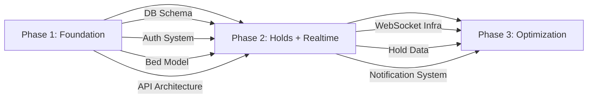

# PHASE_STATUS.md — StaySync

> **Version:** 1.1  
> **Last Updated:** 2026-06-03  
> **Total Phases:** 3  
> **Current Phase:** Phase 1.4 Authentication System

---

## Phase Overview

```
┌─────────────────────────────────────────────────────────────────────┐
│                        DEVELOPMENT ROADMAP                          │
├──────────────┬──────────────────────────────────┬───────────────────┤
│              │                                  │                   │
│   PHASE 1    │           PHASE 2                │     PHASE 3       │
│  Foundation  │      Live Hold System            │   Optimization    │
│  + Auth +    │      + Realtime +                │   + Analytics +   │
│  Property    │      Notifications               │   Production      │
│              │                                  │                   │
│   🔄 IN PROG │         ⏳ QUEUED                 │    ⏳ QUEUED       │
│              │                                  │                   │
└──────────────┴──────────────────────────────────┴───────────────────┘
```

---

## Status Legend

| Icon | Status                 |
| ---- | ---------------------- |
| ⬜   | Not Started            |
| 🔜   | Next Up                |
| 🔄   | In Progress            |
| ✅   | Complete               |
| ❌   | Blocked                |
| ⏳   | Queued (future phase)  |

---

## Phase 1 — Core Foundation + Auth + Property Management

> **Goal:** Establish a scalable, production-grade foundation with complete authentication, role-based access, and full property hierarchy CRUD.

**Status:** 🔄 In Progress  
**Target Completion:** —  
**Dependencies:** None (starting phase)

### Deliverables

#### 1.1 Project Setup & Infrastructure
| #    | Task                                          | Status |
| ---- | --------------------------------------------- | ------ |
| 1.1.1 | Initialize backend project (FastAPI + Poetry/pip) | ✅ |
| 1.1.2 | Initialize frontend project (Vite + React + TS) | ✅ |
| 1.1.3 | Configure TailwindCSS + ShadCN UI              | ✅ |
| 1.1.4 | Docker + Docker Compose setup                   | ✅ |
| 1.1.5 | Environment configuration (.env.example)        | ✅ |
| 1.1.6 | ESLint + Prettier + pyproject.toml config       | ✅ |

#### 1.2 Database Foundation
| #    | Task                                          | Status |
| ---- | --------------------------------------------- | ------ |
| 1.2.1 | Supabase project setup                        | ✅ |
| 1.2.2 | SQLAlchemy base model + session factory        | ✅ |
| 1.2.3 | Alembic migration setup                        | ✅ |
| 1.2.4 | Users + Profiles tables migration              | ✅ |
| 1.2.5 | Property hierarchy tables migration            | ✅ |
| 1.2.6 | Amenities + Images tables migration            | ⬜ |
| 1.2.7 | Saved properties table migration               | ⬜ |
| 1.2.8 | Seed amenities data                            | ⬜ |
| 1.2.9 | Database triggers (updated_at, bed counts)     | ✅ |

#### 1.3 Backend Core Architecture
| #    | Task                                          | Status |
| ---- | --------------------------------------------- | ------ |
| 1.3.1 | FastAPI application factory (main.py)          | ✅ |
| 1.3.2 | Core config (pydantic-settings)                | ✅ |
| 1.3.3 | Custom exception classes + handlers            | ✅ |
| 1.3.4 | Structured logging setup                       | ✅ |
| 1.3.5 | Middleware pipeline (CORS, rate limiter, logging) | ✅ |
| 1.3.6 | Base repository (generic CRUD)                 | ✅ |
| 1.3.7 | Dependency injection setup                     | ✅ |
| 1.3.8 | API response envelope (standard format)        | ✅ |
| 1.3.9 | Health check endpoint                          | ✅ |

#### 1.4 Authentication System
| #    | Task                                          | Status |
| ---- | --------------------------------------------- | ------ |
| 1.4.1 | Password hashing (bcrypt)                      | ⬜ |
| 1.4.2 | JWT access token generation/validation         | ⬜ |
| 1.4.3 | Refresh token rotation                         | ⬜ |
| 1.4.4 | User registration endpoint                     | ⬜ |
| 1.4.5 | User login endpoint                            | ⬜ |
| 1.4.6 | Token refresh endpoint                         | ⬜ |
| 1.4.7 | Logout endpoint (revoke refresh token)         | ⬜ |
| 1.4.8 | Email verification flow (stub for Phase 1)     | ⬜ |
| 1.4.9 | Role-based auth dependencies (RBAC)            | ⬜ |
| 1.4.10| Auth middleware (get_current_user)              | ⬜ |
| 1.4.11| User profile CRUD                              | ⬜ |

#### 1.5 Property Management
| #    | Task                                          | Status |
| ---- | --------------------------------------------- | ------ |
| 1.5.1 | Property CRUD (create, read, update, delete)   | ⬜ |
| 1.5.2 | Floor CRUD                                     | ⬜ |
| 1.5.3 | Room CRUD                                      | ⬜ |
| 1.5.4 | Bed CRUD                                       | ⬜ |
| 1.5.5 | Amenity management (add/remove per property)   | ⬜ |
| 1.5.6 | Image upload to Supabase Storage               | ⬜ |
| 1.5.7 | Image management (reorder, delete, set primary) | ⬜ |
| 1.5.8 | Property listing (paginated, filtered)         | ⬜ |
| 1.5.9 | Property detail endpoint                       | ⬜ |
| 1.5.10| Google Maps location storage                   | ⬜ |
| 1.5.11| Ownership validation middleware                | ⬜ |

#### 1.6 Frontend Foundation
| #    | Task                                          | Status |
| ---- | --------------------------------------------- | ------ |
| 1.6.1 | Design system setup (colors, typography, spacing) | ⬜ |
| 1.6.2 | Root layout + responsive navigation           | ⬜ |
| 1.6.3 | Auth layout (login/register pages)             | ⬜ |
| 1.6.4 | Dashboard layout (sidebar + content area)      | ⬜ |
| 1.6.5 | Reusable components (Button, Input, Card, etc.) | ⬜ |
| 1.6.6 | Axios instance + interceptors (token refresh) | ⬜ |
| 1.6.7 | TanStack Query setup + query client            | ⬜ |
| 1.6.8 | Zustand auth store                             | ⬜ |
| 1.6.9 | Route guards (ProtectedRoute, RoleRoute)       | ⬜ |
| 1.6.10| Error boundary components                      | ⬜ |
| 1.6.11| Skeleton loaders                               | ⬜ |
| 1.6.12| Dark/light mode toggle                         | ⬜ |

#### 1.7 Frontend Pages
| #    | Task                                          | Status |
| ---- | --------------------------------------------- | ------ |
| 1.7.1 | Landing/Home page                              | ⬜ |
| 1.7.2 | Login page                                     | ⬜ |
| 1.7.3 | Registration page                              | ⬜ |
| 1.7.4 | Owner Dashboard page                           | ⬜ |
| 1.7.5 | Add Property page (multi-step form)            | ⬜ |
| 1.7.6 | Manage Properties page                         | ⬜ |
| 1.7.7 | Property Detail page (owner view)              | ⬜ |
| 1.7.8 | Student Browse page                            | ⬜ |
| 1.7.9 | Student Property View page                     | ⬜ |
| 1.7.10| Profile page                                   | ⬜ |
| 1.7.11| 404 Not Found page                             | ⬜ |

### Phase 1 Acceptance Criteria
- [ ] User can register as Student or Owner
- [ ] User can login and receive JWT tokens
- [ ] Token refresh works correctly
- [ ] Owner can create a property with floors, rooms, and beds
- [ ] Owner can upload images for properties/rooms
- [ ] Owner can manage amenities
- [ ] Student can browse and filter properties
- [ ] Student can view property details with bed availability
- [ ] Student can save properties to wishlist
- [ ] All pages are responsive (mobile-first)
- [ ] Dark/light mode works
- [ ] API documentation accessible at `/docs`
- [ ] Docker Compose runs the full stack locally
- [ ] Role-based access control enforced on all endpoints

---

## Phase 2 — Live Hold System + Realtime Features

> **Goal:** Implement the platform's core USP — live accommodation hold management with real-time updates, notifications, and background automation.

**Status:** ⏳ Queued  
**Target Completion:** —  
**Dependencies:** Phase 1 complete

### Deliverables

#### 2.1 Hold Request System
| #    | Task                                          | Status |
| ---- | --------------------------------------------- | ------ |
| 2.1.1 | Hold request creation (with anti-spam checks) | ⬜ |
| 2.1.2 | Hold approval by owner                        | ⬜ |
| 2.1.3 | Hold rejection by owner                       | ⬜ |
| 2.1.4 | Hold cancellation by student                  | ⬜ |
| 2.1.5 | Owner override (immediate occupancy)          | ⬜ |
| 2.1.6 | Hold request listing (student + owner views)  | ⬜ |
| 2.1.7 | Concurrency-safe bed status updates           | ⬜ |
| 2.1.8 | Atomic transaction handling                   | ⬜ |

#### 2.2 Waitlist System
| #    | Task                                          | Status |
| ---- | --------------------------------------------- | ------ |
| 2.2.1 | Auto-add to waitlist when bed is held         | ⬜ |
| 2.2.2 | Queue position tracking                       | ⬜ |
| 2.2.3 | Auto-promotion when hold expires              | ⬜ |
| 2.2.4 | Waitlist cancellation                         | ⬜ |
| 2.2.5 | Waitlist status display on UI                 | ⬜ |

#### 2.3 Background Jobs
| #    | Task                                          | Status |
| ---- | --------------------------------------------- | ------ |
| 2.3.1 | Celery + Redis setup                          | ⬜ |
| 2.3.2 | Hold expiry scheduled task                    | ⬜ |
| 2.3.3 | Hold expiring-soon reminder (1 hour before)   | ⬜ |
| 2.3.4 | Expired token cleanup                         | ⬜ |
| 2.3.5 | Stale listing detection                       | ⬜ |

#### 2.4 Real-Time (WebSocket)
| #    | Task                                          | Status |
| ---- | --------------------------------------------- | ------ |
| 2.4.1 | WebSocket connection manager                  | ⬜ |
| 2.4.2 | Authentication for WebSocket connections      | ⬜ |
| 2.4.3 | Room-based event broadcasting                 | ⬜ |
| 2.4.4 | Bed status change events                      | ⬜ |
| 2.4.5 | Hold status change events                     | ⬜ |
| 2.4.6 | Frontend useWebSocket hook                    | ⬜ |
| 2.4.7 | Reconnection logic                            | ⬜ |
| 2.4.8 | Redis Pub/Sub for multi-instance              | ⬜ |

#### 2.5 Notification System
| #    | Task                                          | Status |
| ---- | --------------------------------------------- | ------ |
| 2.5.1 | In-app notification storage + retrieval       | ⬜ |
| 2.5.2 | Notification bell UI with unread count        | ⬜ |
| 2.5.3 | Mark as read / mark all as read               | ⬜ |
| 2.5.4 | Email notification integration (Resend)       | ⬜ |
| 2.5.5 | Email templates (hold accepted, rejected, etc.) | ⬜ |

#### 2.6 Audit Logging
| #    | Task                                          | Status |
| ---- | --------------------------------------------- | ------ |
| 2.6.1 | Audit log table + repository                  | ⬜ |
| 2.6.2 | Auto-logging on hold/booking status changes   | ⬜ |
| 2.6.3 | Audit log viewer (admin, future)              | ⬜ |

#### 2.7 Frontend — Hold Management UI
| #    | Task                                          | Status |
| ---- | --------------------------------------------- | ------ |
| 2.7.1 | Hold request button on bed cards              | ⬜ |
| 2.7.2 | Hold status display (countdown, waitlist info) | ⬜ |
| 2.7.3 | Owner hold management panel                   | ⬜ |
| 2.7.4 | Student hold tracking page                    | ⬜ |
| 2.7.5 | Real-time bed status color updates            | ⬜ |
| 2.7.6 | Notification dropdown/page                    | ⬜ |
| 2.7.7 | Optimistic UI updates                         | ⬜ |

### Phase 2 Acceptance Criteria
- [ ] Student can request a hold on a vacant bed
- [ ] Only one active hold per bed at a time (enforced atomically)
- [ ] Anti-spam: max 3 active holds per student, 30-min cooldown
- [ ] Owner can approve/reject holds
- [ ] Owner can override hold for immediate occupancy
- [ ] Holds auto-expire after timeout
- [ ] Expired holds auto-promote next waitlisted student
- [ ] Bed status updates propagate in real-time via WebSocket
- [ ] Students receive in-app + email notifications
- [ ] Waitlist shows queue position and estimated wait
- [ ] No double-booking possible under concurrent requests
- [ ] Audit trail for all hold/booking state changes

---

## Phase 3 — Optimization + Scalability + Advanced Features

> **Goal:** Transform the platform into a production-grade, scalable system with analytics, monitoring, security hardening, and polished UX.

**Status:** ⏳ Queued  
**Target Completion:** —  
**Dependencies:** Phase 2 complete

### Deliverables

#### 3.1 Analytics Dashboard
| #    | Task                                          | Status |
| ---- | --------------------------------------------- | ------ |
| 3.1.1 | Owner analytics (occupancy rate, hold stats)  | ⬜ |
| 3.1.2 | Property performance metrics                  | ⬜ |
| 3.1.3 | Trend charts (occupancy over time)            | ⬜ |
| 3.1.4 | Revenue potential estimation                  | ⬜ |

#### 3.2 Search & Filter Optimization
| #    | Task                                          | Status |
| ---- | --------------------------------------------- | ------ |
| 3.2.1 | Full-text search (PostgreSQL)                 | ⬜ |
| 3.2.2 | Distance-based search (PostGIS)               | ⬜ |
| 3.2.3 | Debounced search with instant preview         | ⬜ |
| 3.2.4 | Infinite scroll with cursor pagination        | ⬜ |
| 3.2.5 | Advanced filter combinations                  | ⬜ |

#### 3.3 Performance Optimization
| #    | Task                                          | Status |
| ---- | --------------------------------------------- | ------ |
| 3.3.1 | Redis caching (property listings, bed status) | ⬜ |
| 3.3.2 | Query optimization + N+1 prevention           | ⬜ |
| 3.3.3 | Image optimization (resize, compress, CDN)    | ⬜ |
| 3.3.4 | Frontend lazy loading + code splitting        | ⬜ |
| 3.3.5 | API response compression (gzip/brotli)        | ⬜ |

#### 3.4 Security Hardening
| #    | Task                                          | Status |
| ---- | --------------------------------------------- | ------ |
| 3.4.1 | Rate limiting per endpoint                    | ⬜ |
| 3.4.2 | CSRF protection                               | ⬜ |
| 3.4.3 | Input sanitization audit                      | ⬜ |
| 3.4.4 | Security headers (Helmet equivalent)          | ⬜ |
| 3.4.5 | Dependency vulnerability scan                 | ⬜ |

#### 3.5 Observability
| #    | Task                                          | Status |
| ---- | --------------------------------------------- | ------ |
| 3.5.1 | Structured logging improvements               | ⬜ |
| 3.5.2 | Request tracing (correlation IDs)             | ⬜ |
| 3.5.3 | Health check endpoints (db, redis, celery)    | ⬜ |
| 3.5.4 | Error tracking integration                    | ⬜ |
| 3.5.5 | Monitoring dashboard hooks                    | ⬜ |

#### 3.6 Testing
| #    | Task                                          | Status |
| ---- | --------------------------------------------- | ------ |
| 3.6.1 | Backend unit tests (services, repositories)   | ⬜ |
| 3.6.2 | Backend API integration tests                 | ⬜ |
| 3.6.3 | Frontend component tests (Vitest + RTL)       | ⬜ |
| 3.6.4 | Hold system concurrency tests                 | ⬜ |
| 3.6.5 | Test fixtures + factories                     | ⬜ |

#### 3.7 Reviews System
| #    | Task                                          | Status |
| ---- | --------------------------------------------- | ------ |
| 3.7.1 | Review CRUD API                               | ⬜ |
| 3.7.2 | Rating aggregation on properties              | ⬜ |
| 3.7.3 | Review display on property pages              | ⬜ |
| 3.7.4 | Verified review badges                        | ⬜ |

#### 3.8 UX Polish
| #    | Task                                          | Status |
| ---- | --------------------------------------------- | ------ |
| 3.8.1 | Micro-animations and transitions              | ⬜ |
| 3.8.2 | Skeleton loaders for all data-fetching states | ⬜ |
| 3.8.3 | Empty states with illustrations               | ⬜ |
| 3.8.4 | Toast notifications                           | ⬜ |
| 3.8.5 | Mobile navigation polish                      | ⬜ |
| 3.8.6 | Accessibility audit (a11y)                    | ⬜ |

#### 3.9 Deployment & CI/CD
| #    | Task                                          | Status |
| ---- | --------------------------------------------- | ------ |
| 3.9.1 | Production Docker images                      | ⬜ |
| 3.9.2 | CI pipeline (lint, type-check, test)          | ⬜ |
| 3.9.3 | Production environment configuration          | ⬜ |
| 3.9.4 | Netlify deployment (frontend)                 | ⬜ |
| 3.9.5 | Render deployment (backend)                   | ⬜ |

### Phase 3 Acceptance Criteria
- [ ] Owner analytics dashboard shows occupancy + hold metrics
- [ ] Search returns results in < 200ms with filters
- [ ] Distance-based search works with PostGIS
- [ ] Redis caching reduces DB load by 40%+
- [ ] All critical paths have unit + integration tests
- [ ] Security audit passes (no XSS, SQLi, CSRF vulnerabilities)
- [ ] Health check endpoints return correct statuses
- [ ] Frontend Lighthouse score > 90 (performance)
- [ ] Reviews system functional with verified badges
- [ ] CI pipeline runs on every PR
- [ ] Production deployment successful on Netlify + Render

---

## Cross-Phase Dependencies



---

## Risk Register

| Risk                                   | Impact | Mitigation                              |
| -------------------------------------- | ------ | --------------------------------------- |
| WebSocket scaling with multiple instances | High | Redis Pub/Sub for cross-instance broadcast |
| Race conditions in hold requests       | Critical | Optimistic locking + DB unique constraints |
| Supabase connection pool exhaustion    | High   | Connection pooling + query optimization |
| Email delivery failures               | Medium | Retry queue + fallback logging          |
| Frontend state desync                  | Medium | WebSocket reconnection + periodic refresh |

---

*Update this document after completing each phase and each major deliverable.*